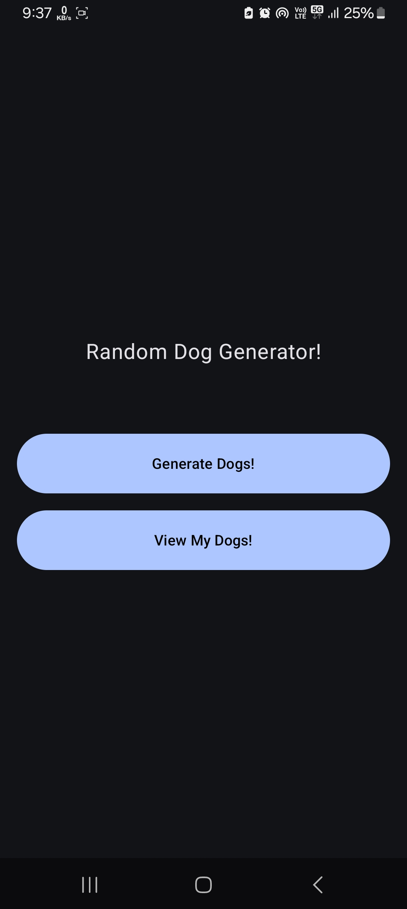
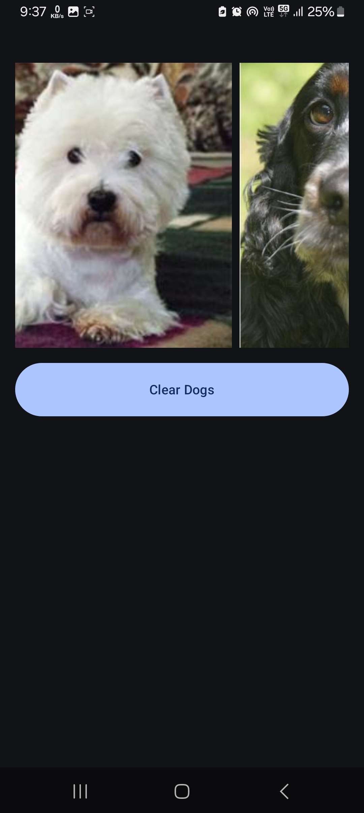

# 🐶 Dog Image Generator

A fun and simple mobile app to generate and view random dog images! This app lets you fetch images from a public API and stores them in a persistent Least Recently Used (LRU) cache for later viewing.

---

## 📱 App Screens

### 1. Home Screen
- The main navigation hub.
- Includes two buttons:
  - **Generate Dogs**
  - **My Recently Generated Dogs**

### 2. Generate Dogs Screen
- Features a **“Generate!”** button.
- Fetches a random dog image from the public API:
  - [`https://dog.ceo/api/breeds/image/random`](https://dog.ceo/api/breeds/image/random)
- Displays the fetched image upon success.
- Adds the image to an **LRU Cache** (max 20 entries).
- The cache **persists across sessions**.

### 3. My Recently Generated Dogs Screen
- Displays a **scrollable gallery** of dog images from the cache.
- Includes a **“Clear Dogs”** button to:
  - Wipe the image cache.
  - Clear the gallery.

---

## 📸 Screenshots

  
  
  

---

## 🎬 App Demo

Demo videos are available inside the `Screenshots/` folder.

---

## 🧠 Technical Notes

- **LRU Cache**:
  - Stores up to 20 images.
  - Oldest entries are removed as new ones are added past capacity.
  - Cache is **persisted using local storage** or an equivalent mechanism depending on the platform (e.g., SharedPreferences, AsyncStorage, etc.).

---

## 📦 API Reference

- Public Dog API: [Dog CEO API](https://dog.ceo/dog-api/)
  - Endpoint used: `/api/breeds/image/random`

---

